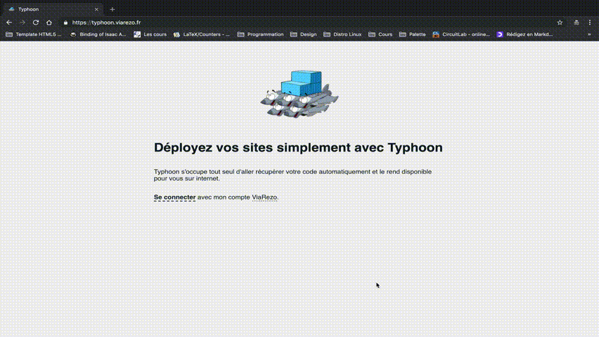

# Typhoon

Here is the repository of the Typhoon project. With Typhoon we allow logged in users to deploy their own websites on our infrastructure, on a given domain name, and with HTTPS.

#### Demo



## Table of Contents

1. [Project architecture](#project-architecture)
   1. [How it works](#how-it-works)
2. [How to deploy the Typhoon project in production](#how-to-deploy-the-typhoon-project-in-production)
   1. [Deploy Backend](#deploy-backend)
   2. [Deploy Frontend](#deploy-frontend)
3. [How to run the project](#how-to-run-the-project)
   1. [Run Backend](#run-backend)
   2. [Run Frontend](#run-frontend)
4. [Documentation](#documentation)
5. [API specification](#api-specification)
   1. [Projects management routes](#projects-management-routes)
   2. [Docker management routes](#docker-management-routes)
   3. [User and Admin management](#user-and-admin-management)
   4. [Miscellaneous](#miscellaneous)
   5.  [Types](#types)

## Project status

Features developed:
- Github and ViaRezo Oauth
- Deploy a site in a variety of languages / frameworks (see UI)
- Redeploy a site at each push
- With databases: Mongo, MySQL, Postgres
- Persistent directories for each project, databases
- See container logs
- Delete a project
- Modifying project parameters is implemented in the back, but not the front yet
- Unit tests for the DAO module (`models_dao_test.go`)
- Integration tests for project creation, status and deleting, using the api (`integration_test.go`)

## Project architecture

The project is deployed via `docker-compose`. It consists of 3 docker composes:

- One for the back (in Go) + DB (in mongo)
- One for the front (in React)
- One for the proxy (using code from of [nginx-proxy](https://github.com/jwilder/nginx-proxy) and a [letsencrypt companion](https://github.com/JrCs/docker-letsencrypt-nginx-proxy-companion))

### How it works

When one creates a project a new entry is created in the database, with the project parameters that include a bunch of information necessary for deployment (port, environmental variables, and so on).

A `Dockerfile` and `docker-compose.yml` are created by parsing a template and filling in the related information from the parameters. Then the docker image is built and the docker-compose is deployed.

The nginx proxy will detect a new container with the right environment variables (`VIRTUAL_HOST` and `LETSENCRYPT_HOST`)has been created and will modify its configuration on the fly, thus redirecting the correct domain name to the project deployed.

## How to deploy the Typhoon project in production

You'll need a machine (preferably debian), and be able to run ansible scripts in that machine. <br>
Git clone `https://github.com/typhoon-docker/ansible.git`. <br>
Follow the `README` (and make sure to update `users.yml` in `ansible/roles/setup_users/vars` with your admin's RSA keys).

This will install `docker`, `go`, `oh-my-zsh`, and create the required directories.

Then, connect into the VM via SSH. Make sure docker is working: `docker run hello-world`. You may have to deal with group issues to be able to run docker from the debian user (use `sudo groupadd docker` to create the group and `sudo usermod -aG docker debian` to add `debian` to it).

Once docker works fine, git clone the typhoon repo in `~`: `https://github.com/typhoon-docker/typhoon.git`. It contains the frontend and backend code.

### Deploy Backend

This projects uses a nginx proxy to deploy the websites. You will need to (from `~`):

```sh
git clone https://github.com/typhoon-docker/docker-nginx-proxy
cd docker-nginx-proxy
mkdir certs
docker network create nginx-proxy
docker-compose up
```

Once the proxy is up and running it's time to run the backend.
Go to the `back` folder of the typhoon project.

First, use the `.env.template` to create the `.env` (copy it and add the correct values):

```
VIAREZO_CLIENT_ID=client_id # App ID for ViaRezo Oauth
VIAREZO_CLIENT_SECRET=client_secret # App secret for ViaRezo Oauth
GITHUB_CLIENT_ID=client_id # App ID for Github Oauth
GITHUB_CLIENT_SECRET=client_secret # App secret for Github Oauth
JWT_SECRET=secret # To sign you tokens, put a random (long) string
```

Then `cd docker_compose_production`. This contains the production docker-compose yml file. <br>
You will have to (manually) modify the `docker-compose.yml`. Replace:

```yml
      - VIRTUAL_HOST=typhoon-back.typhoon.viarezo.fr
      - LETSENCRYPT_HOST=typhoon-back.typhoon.viarezo.fr
      - LETSENCRYPT_EMAIL=aymeric.bernard@student.ecp.fr
```

By changing `typhoon.viarezo.fr` to your domain name.

Then modify `.env.production` in the same way regarding the domain name.

Finally `docker-compose up`.

Do make sure your DNS config (that pointing to the VM) also allows for wildcards as your projects will be deployed as `[project_name].typhoon.viarezo.fr`.

You can use `typhoon-back.[your domain name]/healthCheck` to see it the back is successfully running (and the nginx).

### Deploy Frontend

When deploying a project through Typhoon, we will give you each site access to `TYPHOON_PERSISTENT_DIR` environment variable to a persistent directory.

In a similar fashion, go to the `front` folder from the root. Modify

```yml
      - VIRTUAL_HOST=typhoon.viarezo.fr
      - LETSENCRYPT_HOST=typhoon.viarezo.fr
```

to suit your domain name, as well as `.env.production`:

```
BACKEND_URL=https://typhoon-back.[your domain name]
FRONTEND_URL=https://[your domain name]
```

Then:

- build image: `docker build -t typhoon-front -f docker/Dockerfile .`
- start container: `docker-compose up`

## How to run the project

### Run Backend

- Build image: (from `./back`) `docker build -t typhoon-back-go .`

- Start in dev: (from `./back`) `docker-compose up`
- Start in prod: (from `./back/docker_compose_production`) `docker-compose up`

- Open console (for debug): `docker-compose run code bash`

#### Env variable files that are loaded

| valid `.env` filenames | `GO_ENV=\*` | `GO_ENV=test` |
| ---------------------- | ----------- | ------------- |
| .env                   | ✔️          | ✔️            |
| .env.{GO_ENV}          | ✔️          | ✔️            |
| .env.local             | ✔️          | ✖️            |
| .env.{GO_ENV}.local    | ✔️          | ✖️            |

Notably:
* `GO_ENV` defaults to `development`, can be `development`, `test`, `production`
* `.env.local` and `.env.test.local` are not loaded when `GO_ENV=test` since tests should produce the same results for everyone

#### Run unit tests for the backend

This only applies in development mode.

Once the development backend is running, (also from `./back`), run `docker-compose start typhoon-tests` to rerun the tests. To see the logs, if you run the backend using `docker-compose up`, you will see them in the shell you used to run the backend. If you use `docker-compose up -d`, you can still run `docker-compose logs -f typhoon-tests`

### Run Frontend

- Build image: (from `./front`) `docker build -t typhoon-front -f docker/Dockerfile .`
- Start: (from `./front/docker`) `docker-compose up`

## Documentation

#### GitHub API

- [repositories](https://developer.github.com/v3/repos/)
- [git hooks](https://developer.github.com/v3/repos/hooks/)

#### Oauth

- [Oauth flow](https://oauth2.thephpleague.com/authorization-server/auth-code-grant/)
- [GitHub](https://developer.github.com/apps/building-oauth-apps/authorizing-oauth-apps/)
- [ViaRezo](https://auth.viarezo.fr/docs)

## API specification

### Projects management routes

#### Get my projects, or get all projects if I am admin

`/projects(?all)` - **GET**
- headers: `{ "Authorization: "Bearer <token>" }`
- return: [`[Project]`](#project)

#### Get details by project id

`/projects/:id` - **GET**
- headers: `{ "Authorization: "Bearer <token>" }`
- return: [`Project`](#project)

#### Post a new project (will be added to database but not built)

`/projects` - **POST**
- headers: `{ "Authorization: "Bearer <token>", "Content-Type": "application/json" }`
- body: [Project](#project)
- return: [`[Project]`](#project)

#### Update project with new info (full override, id in url and body must match)

`/projects/:id` - **PUT**
- headers: `{ "Authorization: "Bearer <token>", "Content-Type": "application/json" }`
- body: [Project](#project)
- return: [`[Project]`](#project)

#### Remove a project by id

`/projects/:id` - **DELETE**
- headers: `{ "Authorization: "Bearer <token>" }`
- return: [`[Project]`](#project)

### Docker management routes

#### Return docker files of project (doesn't write them)

`/docker/files/:id` - **GET**
- headers: `{ "Authorization: "Bearer <token>" }`
- return:

```
{
  "project": <project structure>,
  "dockerfile_0": <dockerfile> || "error_dockerfile_0": <error>,
  "docker_compose": <docker_compose> || "error_docker_compose": <error>
}
```

#### Clone, build and run project

`/docker/apply/:id` - **POST**
- headers: `{ "Authorization: "Bearer <token>" }`
- return:

```
{
  "project": <project structure>,
  "dockerfile_0": <dockerfile> || "error_dockerfile_0": <error>,
  "docker_compose": <docker_compose> || "error_docker_compose": <error>
}
```

#### Run project

`/docker/up/:id` - **POST**
- headers: `{ "Authorization: "Bearer <token>" }`
- return: `"OK" || <error>`

#### Undeploy project

`/docker/down/:id` - **POST**
- headers: `{ "Authorization: "Bearer <token>" }`
- return: `"OK" || <error>`

#### Get project status

`/docker/status/:id` - **GET**
- headers: `{ "Authorization: "Bearer <token>" }`
- return: [`[Container]`](#container)

#### Get logs

`/docker/logs/:id?lines=<lines>` - **GET**

- headers: `{ "Authorization: "Bearer <token>" }`
- return: `raw logs`

Parameter lines is optional. Default is 30.

### User and Admin management

#### List all users, or all admins

`/admin/list(?admin)` - **GET**
- headers: `{ "Authorization: "Bearer <token>" }`
- return: [`[User]`](#user)

#### Change user scope

`/admin/scope/:id?scope=<scope>` - **PUT**
- headers: `{ "Authorization: "Bearer <token>" }`
- return: `"OK" || <error>`

#### Edit user

`/admin/user/:id` - **PUT**
- body: [User](#user)
- return: [`User`](#user)

#### Delete user

`/admin/user/:id` - **DELETE**
- return: `user_id`

### Miscellaneous

#### Check if the server is up

`/healthCheck` - **GET**
- return: `"OK"`

#### Check if a project has the given name

`/checkProject?name=<name>` - **GET**
- return: `true` if project with that name exists, else `false`

#### See my token info

`/showme` - **GET**
- headers: `{ "Authorization: "Bearer <token>" }`
- return: `<JWT info>`

### Types

#### Container

```ts
interface Container {
  id: string,
  name: string,
  status: string, // ex: "Up for 14 min."
  state: "created" | "restarting" | "running" | "removing" | "paused" | "exited" | "dead",
}
```

#### User

```ts
interface User {
  id: string,
  oauth_id: string,
  login: string,
  first_name: string,
  last_name: string,
  email: string,
  scope: string,
}
```

#### Project

```ts
interface Project {
  id: string, // omit on POST
  name: string,
  repository_type: string,
  repository_url: string,
  repository_token: string,
  branch: string,
  external_domain_names: Array<string>,
  use_https: boolean,
  template_id: string,
  docker_image_version: string?,
  root_folder: string?,
  exposed_port: int?,
  system_dependencies: Array<string>,
  dependency_files: Array<string>,
  install_script: string?,
  build_script:string?,
  start_script: string?,
  static_folder: string?,
  databases: Array<{
    type: "mysql" | "postgres" | "mongo",
    version: string,
    env_db: string,
    env_user: string,
    env_password: string,
  }>,
  env: { [env: string]: string },
  belongs_to: User, // omit on POST
}
```
